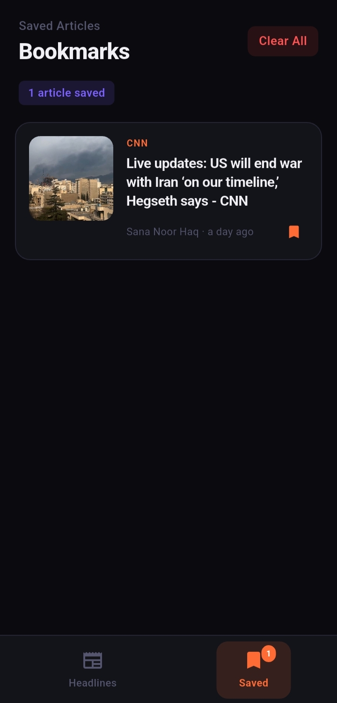

# 📰 NewsWire

> **Stay informed. Beautifully.**

A production-grade Flutter news application featuring a dark editorial design, real-time headlines via NewsAPI, category filtering, search, and offline bookmarks.

---

## 📱 Screenshots

<div align="center">

|                Home Feed                 |                   Article Detail                   |                 Bookmarks                 |
|:----------------------------------------:|:--------------------------------------------------:|:-----------------------------------------:|
|  |  |  |

</div>
---

## ✨ Features

- 🌐 **Live News** — Fetches real headlines from [NewsAPI.org](https://newsapi.org/)
- 🗂️ **8 Categories** — All, Tech, Business, Science, Health, Sports, Culture, World
- 🔍 **Smart Search** — Debounced live search (500ms) across all headlines
- 🔖 **Bookmarks** — Persistent local storage via `shared_preferences`
- 🔄 **Pull to Refresh** — Native refresh on the news feed
- 💀 **Shimmer Loading** — Skeleton placeholders while fetching
- ⚠️ **Error Handling** — Network errors, API errors, and empty states
- 📲 **Open Articles** — Launch full articles in the device browser
- 🌙 **Dark Editorial UI** — Deep dark theme with vivid orange accents

---

## 🚀 Getting Started

### Prerequisites

- Flutter SDK `>=3.0.0`
- Dart `>=3.0.0`
- Android Studio / VS Code with Flutter extension

### Installation

```bash
# 1. Clone or extract the project
cd news_app

# 2. Install dependencies
flutter pub get

# 3. Run the app
flutter run
```

> ✅ **No API key needed to run!** The app ships with 10 built-in mock articles so everything works out of the box.

---

## 🔑 Connecting to Live News (Optional)

### Step 1 — Get a Free API Key
Register at **https://newsapi.org/register** (free tier: 100 requests/day).

### Step 2 — Add Your Key
Open `lib/services/news_service.dart` and replace:

```dart
static const String _apiKey = 'YOUR_API_KEY_HERE';
```

with your actual key:

```dart
static const String _apiKey = 'abc123yourrealapikey';
```

### Step 3 — Internet Permission (Android)
Your `AndroidManifest.xml` should already contain:

```xml
<uses-permission android:name="android.permission.INTERNET"/>
```

That's it — rebuild and run for live headlines! 🎉

---

## 📁 Project Structure

```
lib/
├── main.dart                         # App entry point + bottom navigation
│
├── models/
│   └── article.dart                  # Article & Source data models + JSON parsing
│
├── services/
│   ├── news_service.dart             # NewsAPI integration + mock data fallback
│   └── bookmark_service.dart        # SharedPreferences bookmark persistence
│
├── providers/
│   └── news_provider.dart            # State management with ChangeNotifier
│
├── screens/
│   ├── home_screen.dart              # Main feed (search, categories, pull-to-refresh)
│   ├── article_detail_screen.dart   # Full article view + browser launch
│   └── bookmarks_screen.dart        # Saved articles screen
│
├── widgets/
│   ├── article_card.dart             # Featured hero card + regular card + shimmer
│   ├── category_chips.dart           # Horizontal animated category chips
│   └── search_bar_widget.dart        # Debounced search input
│
└── utils/
    └── theme.dart                    # App-wide dark editorial theme
```

---

## 🏗️ Architecture

```
┌─────────────────────────────────┐
│       UI Layer                  │
│  Screens  ←→  Widgets           │
└────────────┬────────────────────┘
             │ Consumer / context.read
┌────────────▼────────────────────┐
│       Provider Layer            │
│       NewsProvider              │
│  (ChangeNotifier + LoadingState)│
└──────┬──────────────┬───────────┘
       │              │
┌──────▼──────┐ ┌─────▼────────────┐
│ NewsService │ │ BookmarkService   │
│  (HTTP API) │ │ (SharedPrefs)     │
└──────┬──────┘ └──────────────────┘
       │
┌──────▼──────┐
│  NewsAPI.org│
│  (External) │
└─────────────┘
```

### State Management
Uses the `provider` package with `ChangeNotifier`. Loading states are managed via a `LoadingState` enum:

```
idle → loading → loaded
               → error
```

---

## 📦 Dependencies

| Package | Version | Purpose |
|---------|---------|---------|
| `provider` | ^6.1.1 | State management |
| `http` | ^1.2.0 | API requests |
| `shared_preferences` | ^2.2.2 | Local bookmark storage |
| `cached_network_image` | ^3.3.1 | Image caching |
| `shimmer` | ^3.0.0 | Loading skeleton UI |
| `timeago` | ^3.6.1 | Relative timestamps ("2 hours ago") |
| `url_launcher` | ^6.2.5 | Open articles in browser |

---

## 🎨 Design System

| Token | Value | Usage |
|-------|-------|-------|
| `background` | `#0A0A0F` | App background |
| `surface` | `#13131A` | Cards, nav bar |
| `surfaceElevated` | `#1C1C26` | Inputs, chips |
| `accent` | `#FF6B35` | Primary orange — buttons, bookmarks, active states |
| `accentSecondary` | `#7B61FF` | Purple — author avatar, count badge |
| `accentGreen` | `#00D9A3` | Live indicator |
| `textPrimary` | `#F0F0F5` | Headlines |
| `textSecondary` | `#8888AA` | Body text |
| `textMuted` | `#555570` | Timestamps, placeholders |

Typography uses **Playfair Display** (headings) + **DM Sans** (body) for a premium editorial feel.

---

## 🔧 API Details

The app uses the [NewsAPI.org](https://newsapi.org/) REST API.

| Endpoint | Used For |
|----------|----------|
| `GET /v2/top-headlines` | Home feed + category filtering |
| `GET /v2/everything` | Search functionality |

**Free tier limits:** 100 requests/day · US headlines only · No commercial use.

### Error Handling
| Error | Message Shown |
|-------|--------------|
| No internet | "No internet connection. Please check your network." |
| Invalid API key | "Invalid API key. Please check your NewsAPI key." |
| Rate limit hit | "Rate limit exceeded. Please try again later." |
| Timeout (10s) | "Request timed out" |

---

## 🗺️ Roadmap

- [ ] Infinite scroll / pagination
- [ ] Push notifications for breaking news
- [ ] Share article functionality
- [ ] Multiple language support
- [ ] Offline reading mode (cache articles)
- [ ] Article text size settings

---

## 🐛 Troubleshooting

**Images not loading?**
Make sure `INTERNET` permission is in `AndroidManifest.xml` and you are running on a device with an active internet connection.

**"Cleartext HTTP traffic not permitted" error?**
Add `android:usesCleartextTraffic="true"` to the `<application>` tag in `AndroidManifest.xml`, or ensure all image URLs use HTTPS.

**API returning 401?**
Double-check your API key in `lib/services/news_service.dart`. Keys are case-sensitive.

**`flutter pub get` fails?**
Make sure your Flutter SDK is version 3.0.0 or higher: `flutter --version`

---

## 📄 License

This project is for educational and personal use. News content is sourced from [NewsAPI.org](https://newsapi.org/) — please review their [terms of service](https://newsapi.org/terms) before deploying commercially.

---

<div align="center">
  Built with ❤️ using Flutter
</div>
